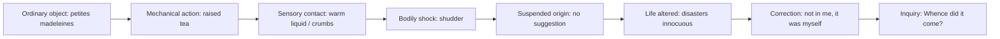

# Chapter 4｜Delay as a Form of Thought

## 0. Chapter Function

Train the reader to understand delay not as difficulty or ornament, but as a form of thinking and perception.

The concrete action is: explain how syntactic delay changes the reader's experience of perception, memory, or judgment.

## 1. Before You Begin

1. Do you treat long syntax as a problem to simplify before asking what it does?
2. Can you explain how delay changes a thought, not just where delay appears?
3. Can your Chinese draft preserve the thinking process rather than only the final meaning?

## 2. Passage Entrance

Source: Marcel Proust, *Swann's Way*, Volume One of *Remembrance of Things Past* / *In Search of Lost Time*

Version: C. K. Scott Moncrieff English translation, Project Gutenberg eBook #7178, 1922

Location: Combray, madeleine / tea sequence

Start Words: She sent out

End Words: seize upon and define it

Passage status: selected

### Original Text

### Original Text Citation and Annotation Layer

> She sent out for one of those short, plump little cakes called 'petites madeleines,' which look as though they had been moulded in the fluted scallop of a pilgrim's shell. And soon, mechanically, weary after a dull day with the prospect of a depressing morrow, I raised to my lips a spoonful of the tea in which I had soaked a morsel of the cake. No sooner had the warm liquid, and the crumbs with it, touched my palate than a shudder ran through my whole body, and I stopped, intent upon the extraordinary changes that were taking place. An exquisite pleasure had invaded my senses, but individual, detached, with no suggestion of its origin. And at once the vicissitudes of life had become indifferent to me, its disasters innocuous, its brevity illusory--this new sensation having had on me the effect which love has of filling me with a precious essence; or rather this essence was not in me, it was myself. I had ceased now to feel mediocre, accidental, mortal. Whence could it have come to me, this all-powerful joy? I was conscious that it was connected with the taste of tea and cake, but that it infinitely transcended those savours, could not, indeed, be of the same nature as theirs. Whence did it come? What did it signify? How could I seize upon and define it?

Annotation table:

| Short citation anchor | Citation function | Grammar note | Movement note | CN recomposition note | Writing transfer note |
|---|---|---|---|---|---|
| "mechanically" | Initial state | Adverb marks action before awareness. | The body acts before thought begins. | Chinese should not turn this immediately into reflective awareness. | Start with unthinking action. |
| "No sooner had the warm liquid" | Delay mechanism | Inverted correlative structure delays the bodily result. | Taste produces shock before explanation. | Preserve the sequence: contact first, meaning later. | Use sensory contact to trigger thought. |
| "with no suggestion of its origin" | Suspended explanation | Negated phrase withholds source. | Pleasure exists before it can be explained. | Keep origin absent; do not name memory too early. | Let experience arrive before cause. |
| "or rather this essence was not in me" | Thought turn | Self-correction revises the prior statement. | Thought changes itself mid-sentence. | Chinese should preserve correction, not smooth it away. | Use "or rather" to show thinking in motion. |
| "Whence did it come?" | Final pressure | Repeated question converts sensation into inquiry. | Delay becomes thinking. | Keep the questions as questions; do not answer them in translation. | End with inquiry rather than conclusion. |

Open annotation question: Which short anchor shows that delay is producing thought, not merely postponing information?

## 3. First Reading

- Read without translating first.
- Mark where the sentence withholds completion.
- Mark what the delay makes you notice before the sentence resolves.
- Mark whether delay changes perception, memory, judgment, or emphasis.
- Copy only the shortest necessary citation anchors into the annotation table.

The task is not to admire difficulty. The task is to name what the delay makes possible.

## 4. Sentence Skeleton

Main clause: "She sent out"; "I raised"; "a shudder ran"; "An exquisite pleasure had invaded"; "I was conscious."

Main verb: "sent"; "raised"; "touched"; "ran"; "stopped"; "invaded"; "had become"; "was."

Delayed element: The origin and meaning of the sensation are delayed through questions.

Inserted phrase(s): "mechanically"; "weary after a dull day"; "and the crumbs with it"; "individual, detached"; "could not, indeed."

Subordinate clause(s): "which look as though"; "in which I had soaked"; "No sooner had ... than"; "that were taking place"; "that it was connected."

Temporal marker(s): "And soon"; "No sooner"; "And at once"; "now."

Sensory unit(s): cakes, scallop shell, tea, crumbs, palate, shudder, pleasure, taste.

Return point: "I was conscious" returns from bodily shock to reflective inquiry.

Completion: The passage refuses final explanation and ends in questions.

Working rule: delay becomes meaningful when it changes the order in which thought is formed.

## 5. Movement Map

Opening: The passage begins with ordinary tea and cake before any great meaning appears.

Delay: Taste and bodily shudder arrive before the narrator knows what they mean.

Expansion: Pleasure changes the value of life, then revises itself from possession to identity.

Suspension: Origin is withheld: "with no suggestion of its origin."

Return: Reflection returns through the repeated questions.

Completion: There is no explanatory closure; the passage completes by turning sensation into inquiry.

The movement makes delay a cognitive device. The sentence thinks by making the reader wait.

## 5A. Sentence Diagram

Reading use:

- Do not name memory before the passage does.
- The thought is produced by sensory delay.
- The questions are part of the form, not a failure to explain.

## 6. English Style Studio

Delay works as thought when rhythm, clause movement, and perception alter judgment. The sentence does not simply postpone information; it stages the conditions under which information becomes meaningful.

Watch for:

- rhythm: whether delay slows judgment
- delay: whether withheld completion changes interpretation
- breath: whether the sentence asks the reader to hold pressure
- clause movement: how subordinate material modifies the final statement
- perception: what the reader sees or feels before explanation
- abstraction: whether thought emerges from concrete sequence
- emphasis: what becomes stronger because it arrives after delay

The style lesson is to ask: what would be lost if this sentence were made direct?

## 7. Chinese Recomposition Studio

Chinese recomposition must decide how much delay can survive without becoming artificial. The central risk is making the thought too direct.

Preserve:

- the thinking sequence
- the delayed judgment
- the pressure of perception before conclusion
- the relation between syntax and thought

Decide:

- Does Chinese need shorter units to keep pressure readable?
- Which conclusion must remain delayed?
- Can punctuation hold suspension?
- Does the draft show thought forming, or only report the thought after formation?

After a source passage is selected, do not produce a final translation unless the reader has first attempted the passage or explicitly requests a final rendering. Produce an annotated recomposition strategy that explains how delay remains a thinking device.

## 7A. CN Recomposition Decision Table

| Source Pressure | Literal Chinese Risk | Better Move | Test Question |
|---|---|---|---|
| "mechanically" precedes awareness | Make the narrator reflective too soon | Preserve bodily automatic action | Does action come before thought? |
| "No sooner had..." delays result through syntax | Flatten into simple cause-effect | Keep contact -> shudder sequence | Does sensation strike before explanation? |
| "with no suggestion of its origin" withholds source | Identify memory too early | Keep origin absent | Does the Chinese allow not-knowing? |
| "or rather" corrects thought midstream | Smooth into one stable claim | Preserve self-correction | Does thought visibly revise itself? |
| Repeated questions close the passage | Add explanatory answer | Keep questions unanswered | Does inquiry replace conclusion? |

## 8. Pattern Work

Pattern name: PATTERN-Delay-as-Thought

Type: Writing Formation Pattern

What it does: Uses syntactic delay to make thought unfold through perception, memory, or qualification.

How to recognize it: The delay changes what the reader understands, not merely when the reader understands it.

How to practice it: Rewrite a direct statement into a delayed sentence and compare how the thought changes.

Proustian function: Delay becomes a method of consciousness, making perception and judgment inseparable.

Chinese adaptation: Preserve the order of thought formation, even when Chinese requires strategic division.

Used in: Chapter 4｜Delay as a Form of Thought

## 9. Practice

### Minimum Mode｜30 min

1. Skeleton-marking exercise: Mark delayed completion and the thought it affects.
2. Movement-map exercise: Write one sentence explaining how delay changes meaning.
3. English style observation: Identify what would be lost in a direct paraphrase.
4. Chinese recomposition attempt: Draft a Chinese version that keeps the conclusion from arriving too early.
5. Writing imitation task: Turn a direct sentence into a delayed sentence that thinks through perception.
6. Citation-annotation task: Choose one short anchor that proves delay changes thought.

### Standard Mode｜60 min

1. Skeleton-marking exercise: Label the grammatical delay and the cognitive delay separately.
2. Movement-map exercise: Map perception -> suspension -> judgment.
3. English style observation: Compare the original movement with a direct paraphrase.
4. Chinese recomposition attempt: Produce two drafts and explain which better preserves thought formation.
5. Writing imitation task: Write a short English or Chinese paragraph where the final sentence changes because of earlier delay.
6. Citation-annotation task: Fill the annotation table with perception, delay, and thought-turn anchors.

### Studio Mode｜90-120 min

1. Skeleton-marking exercise: Build a full syntax/thought map.
2. Movement-map exercise: Explain how delay changes perception, memory, or judgment.
3. English style observation: Mark the sentence's thinking stages.
4. Chinese recomposition attempt: Produce three annotated drafts: direct, delayed, and balanced.
5. Writing imitation task: Write a 150-220 word passage where delayed syntax becomes the method of thinking.
6. Citation-annotation task: Write a source-grounded note explaining why a direct paraphrase loses thought formation.

## 10. Self-Check

- Did I find the sentence center?
- Did I translate too early?
- Did I preserve delay?
- Did I confuse insertion with main movement?
- Did my Chinese rebuild movement rather than merely transfer meaning?
- Can I reuse this pattern in my own prose?
- Did each annotation point back to a real short source anchor?

Also ask: can I explain why the delay matters without using vague praise such as "beautiful" or "complex"?

## 11. What You Can Now Do

You can explain how delay functions as thought and can design English or Chinese prose exercises that use delay to form perception or judgment.

## 12. Next Chapter

Chapter 5 should move from long sentence delay into slow perception. It should consolidate the first four moves rather than introduce a new system.
