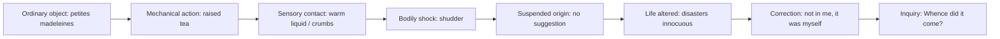

# Chapter 4｜Delay as a Form of Thought

## 1. What You Train

> [!note] What You Train
> Reading delay as a form of thinking.
>
> You are training how to explain how syntactic delay changes the experience of perception, memory, or judgment.

## 2. Core Explanation

> [!note] Core Explanation
> Delay is not only difficulty or ornament. In Proust, delay can make thought happen in time: sensation arrives, meaning is withheld, and judgment forms slowly.
>
> The first task is to mark where delay becomes an act of thought rather than merely a syntactic device.

> [!warning] Do Not Ask For This Yet
> Do not ask AI for a final translation or a full interpretation.
>
> Do not read the Teacher Note before you have marked the delay and drafted a rough Chinese version.

## 3. Input

Source: Marcel Proust, *Swann's Way*, Volume One of *Remembrance of Things Past* / *In Search of Lost Time*

Version: C. K. Scott Moncrieff English translation, Project Gutenberg eBook #7178, 1922

Location: Combray, madeleine / tea sequence

Start Words: She sent out

End Words: seize upon and define it

Passage status: selected

### Source Passage

> She sent out for one of those short, plump little cakes called 'petites madeleines,' which look as though they had been moulded in the fluted scallop of a pilgrim's shell. And soon, mechanically, weary after a dull day with the prospect of a depressing morrow, I raised to my lips a spoonful of the tea in which I had soaked a morsel of the cake. No sooner had the warm liquid, and the crumbs with it, touched my palate than a shudder ran through my whole body, and I stopped, intent upon the extraordinary changes that were taking place. An exquisite pleasure had invaded my senses, but individual, detached, with no suggestion of its origin. And at once the vicissitudes of life had become indifferent to me, its disasters innocuous, its brevity illusory--this new sensation having had on me the effect which love has of filling me with a precious essence; or rather this essence was not in me, it was myself. I had ceased now to feel mediocre, accidental, mortal. Whence could it have come to me, this all-powerful joy? I was conscious that it was connected with the taste of tea and cake, but that it infinitely transcended those savours, could not, indeed, be of the same nature as theirs. Whence did it come? What did it signify? How could I seize upon and define it?

## 4. Recognition Drill

> [!task] Recognition Drill｜From Sensation to Thought
> Mark one example of each:
>
> 1. sensory contact
> 2. bodily reaction
> 3. withheld origin
> 4. self-correction
> 5. unanswered question
>
> Then write one sentence:
> Delay changes thought here because ___.

## 5. Recomposition Drill

> [!task] Recomposition Drill｜Rough Chinese First
> Write a rough Chinese version that preserves delayed thinking.
>
> 1. Keep sensation before explanation.
> 2. Do not name the hidden origin too early.
> 3. Preserve at least one self-correction or unanswered question.
> 4. Identify where your version explains too early.
> 5. Mark the place where thought becomes too direct.

## 6. AI Feedback

> [!tip] AI Feedback Prompt
> I will give you my attempt first.
>
> Do not give a final translation.
> Do not rewrite the whole passage for me.
>
> Evaluate my attempt as a training draft.
>
> Focus on:
> 1. whether I preserved delay as a thinking process;
> 2. whether I explained the meaning too early;
> 3. whether the Chinese recomposition flattened sensation into conclusion;
> 4. the one repair I should make now.
>
> Give no more than 3 feedback points, one repair instruction, and one thinking question.

## 7. Repair Drill

> [!example] Repair Drill
> Repair the moment where thought becomes too direct.
>
> If origin arrives too soon, delay it. If sensation becomes summary, restore the sensory sequence. If the questions are answered too early, let them remain questions.

## 8. Thinking Question

> [!question] Thinking Question
> Which is more important here: naming the meaning clearly or preserving the delay through which meaning becomes thinkable?

## 9. Transfer Drill

> [!example] Transfer Drill
> Turn one direct sentence into a delayed Chinese sentence where perception arrives before judgment.
>
> Then mark the point where the thought changes because of the delay.

## 10. Teacher Note

> [!warning] Read after attempting
> The following Teacher Note is not the starting point.
>
> Use it only after you have completed your recognition drill, rough Chinese recomposition, and AI feedback step.

### Sentence Skeleton

Main clause: "She sent out"; "I raised"; "a shudder ran"; "An exquisite pleasure had invaded"; "I was conscious."

Main verb: "sent"; "raised"; "touched"; "ran"; "stopped"; "invaded"; "had become"; "was."

Delayed element: The origin and meaning of the sensation are delayed through questions.

Inserted phrase(s): "mechanically"; "weary after a dull day"; "and the crumbs with it"; "individual, detached"; "could not, indeed."

Subordinate clause(s): "which look as though"; "in which I had soaked"; "No sooner had ... than"; "that were taking place"; "that it was connected."

Temporal marker(s): "And soon"; "No sooner"; "And at once"; "now."

Sensory unit(s): cakes, scallop shell, tea, crumbs, palate, shudder, pleasure, taste.

Return point: "I was conscious" returns from bodily shock to reflective inquiry.

Completion: The passage refuses final explanation and ends in questions.

Working rule: delay becomes meaningful when it changes the order in which thought is formed.

### Movement Map

Opening: The passage begins with ordinary tea and cake before any great meaning appears.

Delay: Taste and bodily shudder arrive before the narrator knows what they mean.

Expansion: Pleasure changes the value of life, then revises itself from possession to identity.

Suspension: Origin is withheld: "with no suggestion of its origin."

Return: Reflection returns through the repeated questions.

Completion: There is no explanatory closure; the passage completes by turning sensation into inquiry.

The movement makes delay a cognitive device. The sentence thinks by making the reader wait.

### Sentence Diagram

Reading use:

- Do not name memory before the passage does.
- The thought is produced by sensory delay.
- The questions are part of the form, not a failure to explain.

### Citation and Annotation Layer

| Short citation anchor | Citation function | Grammar note | Movement note | CN recomposition note | Writing transfer note |
|---|---|---|---|---|---|
| "mechanically" | Initial state | Adverb marks action before awareness. | The body acts before thought begins. | Chinese should not turn this immediately into reflective awareness. | Start with unthinking action. |
| "No sooner had the warm liquid" | Delay mechanism | Inverted correlative structure delays the bodily result. | Taste produces shock before explanation. | Preserve the sequence: contact first, meaning later. | Use sensory contact to trigger thought. |
| "with no suggestion of its origin" | Suspended explanation | Negated phrase withholds source. | Pleasure exists before it can be explained. | Keep origin absent; do not name memory too early. | Let experience arrive before cause. |
| "or rather this essence was not in me" | Thought turn | Self-correction revises the prior statement. | Thought changes itself mid-sentence. | Chinese should preserve correction, not smooth it away. | Use "or rather" to show thinking in motion. |
| "Whence did it come?" | Final pressure | Repeated question converts sensation into inquiry. | Delay becomes thinking. | Keep the questions as questions; do not answer them in translation. | End with inquiry rather than conclusion. |

Question: Which short anchor shows that delay is producing thought, not merely postponing information?

### English Style Note

Delay works as thought when rhythm, clause movement, and perception alter judgment. The sentence does not simply postpone information; it stages the conditions under which information becomes meaningful.

Watch for:

- rhythm: whether delay slows judgment
- delay: whether withheld completion changes interpretation
- breath: whether the sentence asks the reader to hold pressure
- clause movement: how subordinate material modifies the final statement
- perception: what the reader sees or feels before explanation
- abstraction: whether thought emerges from concrete sequence
- emphasis: what becomes stronger because it arrives after delay

The style lesson is to ask: what would be lost if this sentence were made direct?

### Chinese Recomposition Note

Chinese recomposition must decide how much delay can survive without becoming artificial. The central risk is making the thought too direct.

Preserve:

- the thinking sequence
- the delayed judgment
- the pressure of perception before conclusion
- the relation between syntax and thought

Decide:

- Does Chinese need shorter units to keep pressure readable?
- Which conclusion must remain delayed?
- Can punctuation hold suspension?
- Does the draft show thought forming, or only report the thought after formation?

After a source passage is selected, do not produce a final translation unless the reader has first attempted the passage or explicitly requests a final rendering. Produce an annotated recomposition strategy that explains how delay remains a thinking device.

### CN Recomposition Decision Table

| Source Pressure | Literal Chinese Risk | Better Move | Test Question |
|---|---|---|---|
| "mechanically" precedes awareness | Make the narrator reflective too soon | Preserve bodily automatic action | Does action come before thought? |
| "No sooner had..." delays result through syntax | Flatten into simple cause-effect | Keep contact -> shudder sequence | Does sensation strike before explanation? |
| "with no suggestion of its origin" withholds source | Identify memory too early | Keep origin absent | Does the Chinese allow not-knowing? |
| "or rather" corrects thought midstream | Smooth into one stable claim | Preserve self-correction | Does thought visibly revise itself? |
| Repeated questions close the passage | Add explanatory answer | Keep questions unanswered | Does inquiry replace conclusion? |

### Pattern Explanation

Pattern name: PATTERN-Delay-as-Thought

Type: Writing Formation Pattern

What it does: Uses syntactic delay to make thought unfold through perception, memory, or qualification.

How to recognize it: The delay changes what the reader understands, not merely when the reader understands it.

How to practice it: Rewrite a direct statement into a delayed sentence and compare how the thought changes.

Proustian function: Delay becomes a method of consciousness, making perception and judgment inseparable.

Chinese adaptation: Preserve the order of thought formation, even when Chinese requires strategic division.

Used in: Chapter 4｜Delay as a Form of Thought

## 11. Movement Card

> [!abstract] Movement Card｜Delay as a Form of Thought
> **Source**
> Combray, madeleine / tea sequence; "She sent out" to "seize upon and define it."
>
> **My Try**
> One sentence about how I first handled delayed thinking.
>
> **AI Feedback**
> No more than 3 points.
>
> **Repair**
> What I changed after feedback.
>
> **Pattern**
> Delay makes sensation, memory, and judgment form in sequence rather than appear as a finished explanation.
>
> **CN Recomposition Rule**
> Do not explain the thought too early. Preserve sensation before conclusion and inquiry before answer.
>
> **Reuse**
> Next time I meet delayed thought, I ask what the delay makes possible before I translate.

## 12. Self-Check

- Can I mark where delay becomes thinking?
- Can I keep sensation before explanation?
- Can I identify where my Chinese explains too early?
- Can I preserve unanswered questions without adding an answer?
- Can I save one Movement Card from this training?
